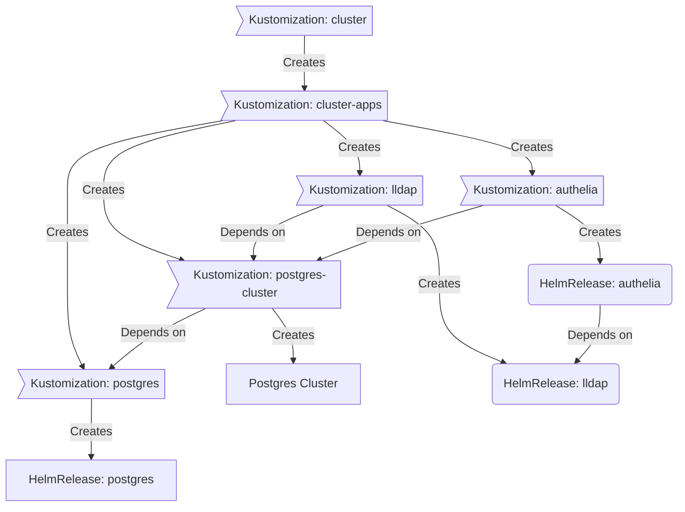

<div align="center">


### My Home Operations Repository :octocat:

_... managed with Flux, Renovate, and GitHub Actions_ 🤖

</div>

<div align="center">

[](https://discord.gg/home-operations)&nbsp;&nbsp;
[](https://k3s.io/)&nbsp;&nbsp;
[](https://github.com/onedr0p/home-ops/actions/workflows/renovate.yaml)

</div>

<div align="center">

[](https://status.devbu.io)&nbsp;&nbsp;
[](https://status.devbu.io)&nbsp;&nbsp;
[](https://status.devbu.io)

</div>

<div align="center">

[](https://github.com/kashalls/kromgo/)&nbsp;&nbsp;
[](https://github.com/kashalls/kromgo/)&nbsp;&nbsp;
[](https://github.com/kashalls/kromgo/)&nbsp;&nbsp;
[](https://github.com/kashalls/kromgo/)&nbsp;&nbsp;
[](https://github.com/kashalls/kromgo/)&nbsp;&nbsp;
[](https://github.com/kashalls/kromgo/)&nbsp;&nbsp;
[](https://github.com/kashalls/kromgo/)

</div>

---

## 📖 Overview

This is a mono repository for my home infrastructure and Kubernetes cluster. I try to adhere to Infrastructure as Code (IaC) and GitOps practices using tools like [Ansible](https://www.ansible.com/), [Terraform](https://www.terraform.io/), [Kubernetes](https://kubernetes.io/), [Flux](https://github.com/fluxcd/flux2), [Renovate](https://github.com/renovatebot/renovate), and [GitHub Actions](https://github.com/features/actions).

---

## ⛵ Kubernetes

There is a template over at [onedr0p/cluster-template](https://github.com/onedr0p/cluster-template) if you want to try and follow along with some of the practices I use here.

### Installation

My Kubernetes cluster is deploy with [Talos](https://www.talos.dev). This is a semi-hyper-converged cluster, workloads and block storage are sharing the same available resources on my nodes while I have a separate server with ZFS for NFS/SMB shares, bulk file storage and backups.

### Core Components

- [actions-runner-controller](https://github.com/actions/actions-runner-controller): self-hosted Github runners
- [cilium](https://github.com/cilium/cilium): internal Kubernetes networking plugin
- [cert-manager](https://cert-manager.io/docs/): creates SSL certificates for services in my cluster
- [external-dns](https://github.com/kubernetes-sigs/external-dns): automatically syncs DNS records from my cluster ingresses to a DNS provider
- [external-secrets](https://github.com/external-secrets/external-secrets/): managed Kubernetes secrets using [1Password Connect](https://github.com/1Password/connect).
- [ingress-nginx](https://github.com/kubernetes/ingress-nginx/): ingress controller for Kubernetes using NGINX as a reverse proxy and load balancer
- [rook](https://github.com/rook/rook): distributed block storage for persistent storage
- [sops](https://toolkit.fluxcd.io/guides/mozilla-sops/): managed secrets for Kubernetes, Ansible, and Terraform which are committed to Git
- [spegel](https://github.com/XenitAB/spegel): stateless cluster local OCI registry mirror
- [tf-controller](https://github.com/weaveworks/tf-controller): additional Flux component used to run Terraform from within a Kubernetes cluster.
- [volsync](https://github.com/backube/volsync): backup and recovery of persistent volume claims

### GitOps

[Flux](https://github.com/fluxcd/flux2) watches the clusters in my [kubernetes](./kubernetes/) folder (see Directories below) and makes the changes to my clusters based on the state of my Git repository.

The way Flux works for me here is it will recursively search the `kubernetes/${cluster}/apps` folder until it finds the most top level `kustomization.yaml` per directory and then apply all the resources listed in it. That aforementioned `kustomization.yaml` will generally only have a namespace resource and one or many Flux kustomizations (`ks.yaml`). Under the control of those Flux kustomizations there will be a `HelmRelease` or other resources related to the application which will be applied.

[Renovate](https://github.com/renovatebot/renovate) watches my **entire** repository looking for dependency updates, when they are found a PR is automatically created. When some PRs are merged Flux applies the changes to my cluster.

### Directories

This Git repository contains the following directories under [Kubernetes](./kubernetes/).

```sh
📁 kubernetes
├── 📁 main            # main cluster
│   ├── 📁 apps           # applications
│   ├── 📁 bootstrap      # bootstrap procedures
│   ├── 📁 flux           # core flux configuration
│   └── 📁 templates      # re-useable components
└── 📁 storage         # storage cluster
    ├── 📁 apps           # applications
    ├── 📁 bootstrap      # bootstrap procedures
    └── 📁 flux           # core flux configuration
```

### Flux Workflow

This is a high-level look how Flux deploys my applications with dependencies. Below there are 3 apps `postgres`, `lldap` and `authelia`. `postgres` is the first app that needs to be running and healthy before `lldap` and `authelia`. Once `postgres` is healthy `lldap` will be deployed and after that is healthy `authelia` will be deployed.



### Networking

<details>
  <summary>Click to see a high-level network diagram</summary>

  
</details>

---

## ☁️ Cloud Dependencies

While most of my infrastructure and workloads are self-hosted I do rely upon the cloud for certain key parts of my setup. This saves me from having to worry about two things. (1) Dealing with chicken/egg scenarios and (2) services I critically need whether my cluster is online or not.

The alternative solution to these two problems would be to host a Kubernetes cluster in the cloud and deploy applications like [HCVault](https://www.vaultproject.io/), [Vaultwarden](https://github.com/dani-garcia/vaultwarden), [ntfy](https://ntfy.sh/), and [Gatus](https://gatus.io/). However, maintaining another cluster and monitoring another group of workloads is a lot more time and effort than I am willing to put in.

| Service                                         | Use                                                               | Cost           |
|-------------------------------------------------|-------------------------------------------------------------------|----------------|
| [1Password](https://1password.com/)             | Secrets with [External Secrets](https://external-secrets.io/)     | ~$65/yr        |
| [Cloudflare](https://www.cloudflare.com/)       | Domain and S3                                                     | ~$30/yr        |
| [Frugal](https://frugalusenet.com/)             | Usenet access                                                     | ~$35/yr        |
| [GCP](https://cloud.google.com/)                | Voice interactions with Home Assistant over Google Assistant      | Free           |
| [GitHub](https://github.com/)                   | Hosting this repository and continuous integration/deployments    | Free           |
| [Migadu](https://migadu.com/)                   | Email hosting                                                     | ~$20/yr        |
| [NextDNS](https://nextdns.io/)                  | My router DNS server which includes AdBlocking                    | ~$20/yr        |
| [Pushover](https://pushover.net/)               | Kubernetes Alerts and application notifications                   | $5 OTP         |
| [Terraform Cloud](https://www.terraform.io/)    | Storing Terraform state                                           | Free           |
| [UptimeRobot](https://uptimerobot.com/)         | Monitoring internet connectivity and external facing applications | ~$60/yr        |
|                                                 |                                                                   | Total: ~$20/mo |

---

## 🌐 DNS

### Home DNS

On my Vyos router I have [Bind9](https://github.com/isc-projects/bind9) and [dnsdist](https://dnsdist.org/) deployed as containers. In my cluster `external-dns` is deployed with the `RFC2136` provider which syncs DNS records to `bind9`.

Downstream DNS servers configured in `dnsdist` such as `bind9` (above) and [NextDNS](https://nextdns.io/). All my clients use `dnsdist` as the upstream DNS server, this allows for more granularity with configuring DNS across my networks. These could be things like giving each of my VLANs a specific `nextdns` profile, or having all requests for my domain forward to `bind9` on certain networks, or only using `1.1.1.1` instead of `nextdns` on certain networks where adblocking isn't required.

### Public DNS

Outside the `external-dns` instance mentioned above another instance is deployed in my cluster and configured to sync DNS records to [Cloudflare](https://www.cloudflare.com/). The only ingress this `external-dns` instance looks at to gather DNS records to put in `Cloudflare` are ones that have an ingress class name of `external` and contain an ingress annotation `external-dns.alpha.kubernetes.io/target`.

---

## 🔧 Hardware

<details>
  <summary>Click to see the rack!</summary>

  
</details>

| Device                      | Count | OS Disk Size | Data Disk Size              | Ram  | Operating System | Purpose                |
|-----------------------------|-------|--------------|-----------------------------|------|------------------|------------------------|
| Intel NUC8i5BEH             | 3     | 1TB SSD      | 1TB NVMe (rook-ceph)        | 64GB | Debian           | Kubernetes Controllers |
| Intel NUC8i7BEH             | 3     | 1TB SSD      | 1TB NVMe (rook-ceph)        | 64GB | Debian           | Kubernetes Workers     |
| PowerEdge T340              | 1     | 2TB SSD      | 8x12TB ZFS (mirrored vdevs) | 64GB | Ubuntu           | NFS + Backup Server    |
| Lenovo SA120                | 1     | -            | 6x12TB (+2 hot spares)      | -    | -                | DAS                    |
| Raspberry Pi 4              | 1     | 32GB (SD)    | -                           | 4GB  | PiKVM (Arch)     | Network KVM            |
| TESmart 8 Port KVM Switch   | 1     | -            | -                           | -    | -                | Network KVM (PiKVM)    |
| HP EliteDesk 800 G3 SFF     | 1     | 256GB NVMe   | -                           | 8GB  | Vyos (Debian)    | Router                 |
| Unifi US-16-XG              | 1     | -            | -                           | -    | -                | 10Gb Core Switch       |
| Unifi USW-Enterprise-24-PoE | 1     | -            | -                           | -    | -                | 2.5Gb PoE Switch       |
| Unifi USP PDU Pro           | 1     | -            | -                           | -    | -                | PDU                    |
| APC SMT1500RM2U w/ NIC      | 1     | -            | -                           | -    | -                | UPS                    |

---

## ⭐ Stargazers

<div align="center">

[](https://star-history.com/#onedr0p/home-ops&Date)

</div>

---

## 🤝 Gratitude and Thanks

Thanks to all the people who donate their time to the [Home Operations](https://discord.gg/home-operations) Discord community. Be sure to check out [kubesearch.dev](https://kubesearch.dev/) for ideas on how to deploy applications or get ideas on what you may deploy.

---

## 📜 Changelog

See my _awful_ [commit history](https://github.com/onedr0p/home-ops/commits/main)

---

## 🔏 License

See [LICENSE](./LICENSE)
