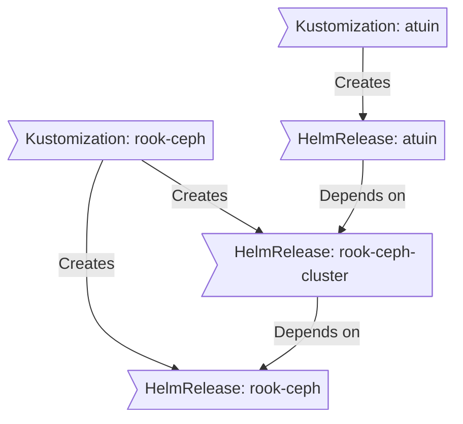

<div align="center">


###  My Home Operations Repository 

_... managed with Flux, Renovate, and GitHub Actions_ 

</div>

<div align="center">

[](https://discord.gg/home-operations)&nbsp;&nbsp;
[](https://talos.dev)&nbsp;&nbsp;
[](https://kubernetes.io)&nbsp;&nbsp;
[](https://fluxcd.io)&nbsp;&nbsp;
[](https://github.com/onedr0p/home-ops/actions/workflows/renovate.yaml)

</div>

<div align="center">

[](https://status.turbo.ac)&nbsp;&nbsp;
[](https://status.turbo.ac)&nbsp;&nbsp;
[](https://status.turbo.ac)

</div>

<div align="center">

[](https://github.com/kashalls/kromgo)&nbsp;&nbsp;
[](https://github.com/kashalls/kromgo)&nbsp;&nbsp;
[](https://github.com/kashalls/kromgo)&nbsp;&nbsp;
[](https://github.com/kashalls/kromgo)&nbsp;&nbsp;
[](https://github.com/kashalls/kromgo)&nbsp;&nbsp;
[](https://github.com/kashalls/kromgo)&nbsp;&nbsp;
[](https://github.com/kashalls/kromgo)&nbsp;&nbsp;
[](https://github.com/kashalls/kromgo)

</div>

---

##  Overview

This is a mono repository for my home infrastructure and Kubernetes cluster. I try to adhere to Infrastructure as Code (IaC) and GitOps practices using tools like [Ansible](https://www.ansible.com/), [Terraform](https://www.terraform.io/), [Kubernetes](https://kubernetes.io/), [Flux](https://github.com/fluxcd/flux2), [Renovate](https://github.com/renovatebot/renovate), and [GitHub Actions](https://github.com/features/actions).

---

##  Kubernetes

My Kubernetes cluster is deployed with [Talos](https://www.talos.dev). This is a semi-hyper-converged cluster, workloads and block storage are sharing the same available resources on my nodes while I have a separate server with ZFS for NFS/SMB shares, bulk file storage and backups.

There is a template over at [onedr0p/cluster-template](https://github.com/onedr0p/cluster-template) if you want to try and follow along with some of the practices I use here.

### Core Components

- **Networking & Service Mesh**: [cilium](https://github.com/cilium/cilium) provides eBPF-based networking, while [istio](https://istio.io/latest/) powers service-to-service communication with L7 proxying and traffic management. [cloudflared](https://github.com/cloudflare/cloudflared) secures ingress traffic via Cloudflare, and [external-dns](https://github.com/kubernetes-sigs/external-dns) keeps DNS records in sync automatically.
- **Security & Secrets**: [cert-manager](https://github.com/cert-manager/cert-manager) automates SSL/TLS certificate management. For secrets, I use [external-secrets](https://github.com/external-secrets/external-secrets) with [1Password Connect](https://github.com/1Password/connect) to inject secrets into Kubernetes.
- **Storage & Data Protection**: [rook](https://github.com/rook/rook) provides distributed storage for persistent volumes, with [volsync](https://github.com/backube/volsync) handling backups and restores. [spegel](https://github.com/spegel-org/spegel) improves reliability by running a stateless, cluster-local OCI image mirror.
- **Automation & CI/CD**: [actions-runner-controller](https://github.com/actions/actions-runner-controller) runs self-hosted GitHub Actions runners directly in the cluster for continuous integration workflows.

### GitOps

[Flux](https://github.com/fluxcd/flux2) watches the clusters in my [kubernetes](./kubernetes/) folder (see Directories below) and makes the changes to my clusters based on the state of my Git repository.

The way Flux works for me here is it will recursively search the `kubernetes/apps` folder until it finds the most top level `kustomization.yaml` per directory and then apply all the resources listed in it. That aforementioned `kustomization.yaml` will generally only have a namespace resource and one or many Flux kustomizations (`ks.yaml`). Under the control of those Flux kustomizations there will be a `HelmRelease` or other resources related to the application which will be applied.

[Renovate](https://github.com/renovatebot/renovate) watches my **entire** repository looking for dependency updates, when they are found a PR is automatically created. When some PRs are merged Flux applies the changes to my cluster.

### Directories

This Git repository contains the following directories under [Kubernetes](./kubernetes/).

```sh
📁 kubernetes
├── 📁 apps       # applications
├── 📁 components # re-useable kustomize components
└── 📁 flux       # flux system configuration
```

### Flux Workflow

This is a high-level look how Flux deploys my applications with dependencies. In most cases a `HelmRelease` will depend on other `HelmRelease`'s, in other cases a `Kustomization` will depend on other `Kustomization`'s, and in rare situations an app can depend on a `HelmRelease` and a `Kustomization`. The example below shows that `atuin` won't be deployed or upgrade until the `rook-ceph-cluster` Helm release is installed or in a healthy state.



### Networking

<details>
  <summary>Click here to see my high-level network diagram</summary>

  
</details>

---

##  Cloud Dependencies

While most of my infrastructure and workloads are self-hosted I do rely upon the cloud for certain key parts of my setup. This saves me from having to worry about three things. (1) Dealing with chicken/egg scenarios, (2) services I critically need whether my cluster is online or not and (3) The "hit by a bus factor" - what happens to critical apps (e.g. Email, Password Manager, Photos) that my family relies on when I no longer around.

Alternative solutions to the first two of these problems would be to host a Kubernetes cluster in the cloud and deploy applications like [HCVault](https://www.vaultproject.io/), [Vaultwarden](https://github.com/dani-garcia/vaultwarden), [ntfy](https://ntfy.sh/), and [Gatus](https://gatus.io/); however, maintaining another cluster and monitoring another group of workloads would be more work and probably be more or equal out to the same costs as described below.

| Service                                   | Use                                                            | Cost           |
|-------------------------------------------|----------------------------------------------------------------|----------------|
| [1Password](https://1password.com/)       | Secrets with [External Secrets](https://external-secrets.io/)  | ~$65/yr        |
| [Cloudflare](https://www.cloudflare.com/) | Domain and S3                                                  | ~$50/yr        |
| [GCP](https://cloud.google.com/)          | Voice interactions with Home Assistant over Google Assistant   | Free           |
| [GitHub](https://github.com/)             | Hosting this repository and continuous integration/deployments | Free           |
| [Migadu](https://migadu.com/)             | Email hosting                                                  | ~$20/yr        |
| [Pushover](https://pushover.net/)         | Kubernetes Alerts and application notifications                | $5 OTP         |
|                                           |                                                                | Total: ~$10/mo |

---

##  DNS

In my cluster there are two instances of [ExternalDNS](https://github.com/kubernetes-sigs/external-dns) running. One for syncing private DNS records to my `UDM Pro Max` using [ExternalDNS webhook provider for UniFi](https://github.com/kashalls/external-dns-unifi-webhook), while another instance syncs public DNS to `Cloudflare`. This setup is managed by creating ingresses with two specific classes: `internal` for private DNS and `external` for public DNS. The `external-dns` instances then syncs the DNS records to their respective platforms accordingly.

---

##  Hardware

<details>
  <summary>Click here to see my server rack</summary>

  
</details>

| Device                      | Num | OS Disk Size | Data Disk Size                  | Ram  | OS            | Function                |
|-----------------------------|-----|--------------|---------------------------------|------|---------------|-------------------------|
| ASUS NUC 14 Pro CU 5 125H   | 3   | 1TB SSD      | 1TB (local) / 800GB (rook-ceph) | 96GB | Talos         | Kubernetes              |
| Dell PowerEdge T340         | 1   | 1TB SSD      | 8x22TB ZFS (mirrored vdevs)     | 64GB | TrueNAS SCALE | NFS + Backup Server     |
| JetKVM                      | 3   | -            | -                               | -    | -             | KVM for Kubernetes      |
| UniFi UDMP Max              | 1   | -            | 2x4TB HDD                       | -    | -             | Router & NVR            |
| UniFi USW-Enterprise-24-PoE | 1   | -            | -                               | -    | -             | 2.5Gb PoE Switch        |
| UniFi USP PDU Pro           | 1   | -            | -                               | -    | -             | PDU                     |
| APC SMT1500RM2U             | 1   | -            | -                               | -    | -             | UPS                     |

---

##  Stargazers

<div align="center">

<a href="https://star-history.com/#onedr0p/home-ops&Date">
  <picture>
    <source media="(prefers-color-scheme: dark)" srcset="https://api.star-history.com/svg?repos=onedr0p/home-ops&type=Date&theme=dark" />
    <source media="(prefers-color-scheme: light)" srcset="https://api.star-history.com/svg?repos=onedr0p/home-ops&type=Date" />
    
  </picture>
</a>

</div>

---

##  Gratitude and Thanks

Thanks to all the people who donate their time to the [Home Operations](https://discord.gg/home-operations) Discord community. Be sure to check out [kubesearch.dev](https://kubesearch.dev/) for ideas on how to deploy applications or get ideas on what you could deploy.

---

<div align="center">

[](https://deepwiki.com/onedr0p/home-ops)

</div>
